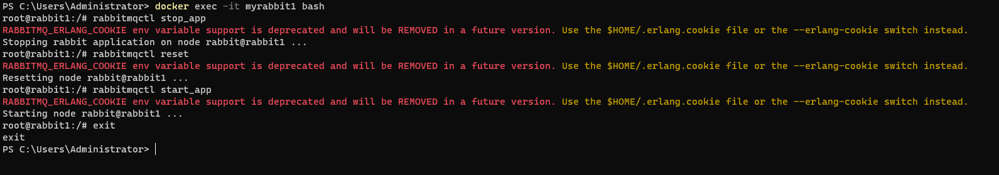
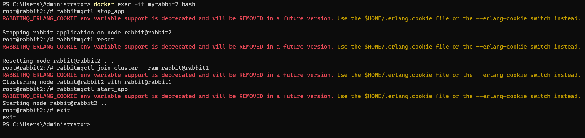
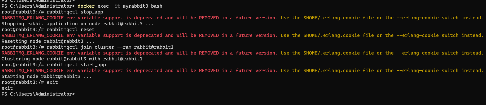
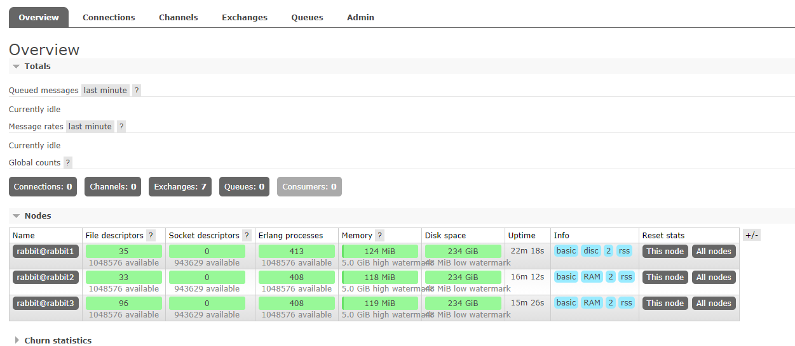
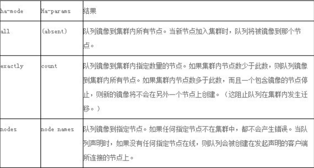
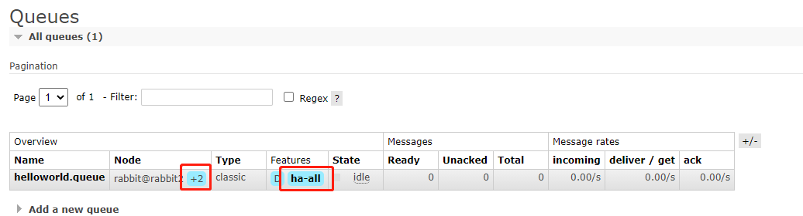

# Docker中搭建RabbitMQ集群

## 1、拉取镜像

``` powershell
PS C:\Users\Administrator> docker pull rabbitmq:management
```

## 2、运行容器

``` powershell
PS C:\Users\Administrator> docker run -d --hostname rabbit1 --name myrabbit1 -p 15672:15672 -p 5672:5672 -e RABBITMQ_ERLANG_COOKIE='rabbitmq_cookie' rabbitmq:management
PS C:\Users\Administrator> docker run -d --hostname rabbit2 --name myrabbit2 -p 5673:5672 --link myrabbit1:rabbit1 -e RABBITMQ_ERLANG_COOKIE='rabbitmq_cookie' rabbitmq:management
PS C:\Users\Administrator> docker run -d --hostname rabbit3 --name myrabbit3 -p 5674:5672 --link myrabbit1:rabbit1 --link myrabbit2:rabbit2 -e RABBITMQ_ERLANG_COOKIE='rabbitmq_cookie' rabbitmq:management
```

-p 15672:15672 management 界面管理访问端口
-p 5672:5672 amqp 访问端口
--link 容器之间连接
Erlang Cookie 值必须相同，也就是一个集群内 RABBITMQ_ERLANG_COOKIE 参数的值必须相同。因为 RabbitMQ 是用Erlang实现的，Erlang Cookie 相当于不同节点之间通讯的密钥，Erlang节点通过交换 Erlang Cookie 获得认证。

## 3、加入节点到集群

### 设置节点1

``` powershell
PS C:\Users\Administrator> docker exec -it myrabbit1 bash
root@rabbit1:/# rabbitmqctl stop_app
root@rabbit1:/# rabbitmqctl reset
root@rabbit1:/# rabbitmqctl start_app
root@rabbit1:/# exit
```



### 设置节点2

``` powershell
PS C:\Users\Administrator> docker exec -it myrabbit2 bash
root@rabbit2:/# rabbitmqctl stop_app
root@rabbit2:/# rabbitmqctl reset
root@rabbit2:/# rabbitmqctl join_cluster --ram rabbit@rabbit1
root@rabbit2:/# rabbitmqctl start_app
root@rabbit2:/# exit
```



### 设置节点3

``` powershell
PS C:\Users\Administrator> docker exec -it myrabbit3 bash
root@rabbit2:/# rabbitmqctl stop_app
root@rabbit2:/# rabbitmqctl reset
root@rabbit2:/# rabbitmqctl join_cluster --ram rabbit@rabbit1
root@rabbit2:/# rabbitmqctl start_app
root@rabbit2:/# exit
```



**主要参数：**

--ram 表示设置为内存节点，忽略参数默认为磁盘节点。该配置启动了3个节点，1个磁盘节点和2个内存节点。

设置好之后，使用http://物理机ip:15672 进行访问了，默认账号密码是guest/guest

启动了3个节点，1个磁盘节点和2个内存节点



可以看到有很多节点

## RabbitMQ镜像集群部署

### 策略policy概念

使用RabbitMQ镜像功能，需要基于RabbitMQ策略来实现，策略policy是用来控制和修改群集范围的某个vhost队列行为和Exchange行为。策略policy就是要设置哪些Exchange或者queue的数据需要复制、同步，以及如何复制同步。

为了使队列成为镜像队列，需要创建一个策略来匹配队列，设置策略有两个键“ha-mode和 ha-params（可选）”。ha-params根据ha-mode设置不同的值，下表说明这些key的选项。



### 添加策略

``` powershell
PS C:\Users\Administrator> docker exec -it myrabbit1 bash
root@rabbit1:/# rabbitmqctl set_policy ha-all "^" '{"ha-mode":"all"}'
```

### 查看效果

此策略会同步所在同一VHost中的交换器和队列数据。设置好policy之后，使用 http://ip:15672 再次进行访问，可以看到队列镜像同步。




